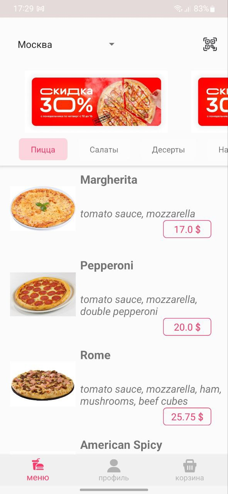
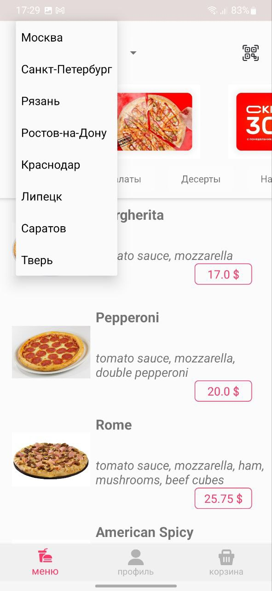
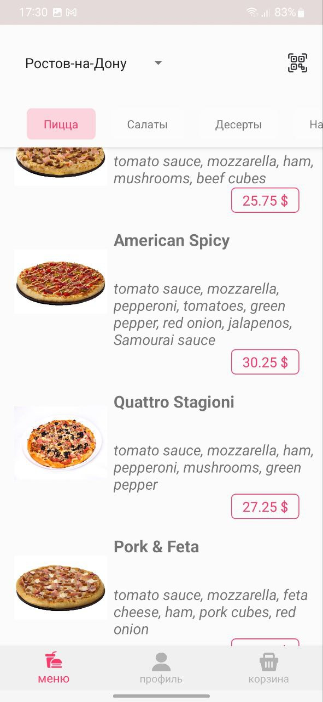

# FoodDeliveryApp
Completed the test task.

What needed to be done:
●
The main screen of the food delivery application, the design is based on the link above
●
You can upload any photos to the banners
●
The main task is to make an identical bar with categories and
a menu block (Hint. For implementation, you can use
Collapsing Toolbar Layout)
●
The bar with categories should stick to the upper
bar when scrolling (for example, you can see the Dodo Pizza application).
●
Use any open source suitable for
current needs as an API
Optional:
●
Offline mode: i.e., if there is no access to the network, show
the latest downloaded data (both the feed and details).

Limitations on the technology stack:
●
MVVM
●
Clean Architecture

